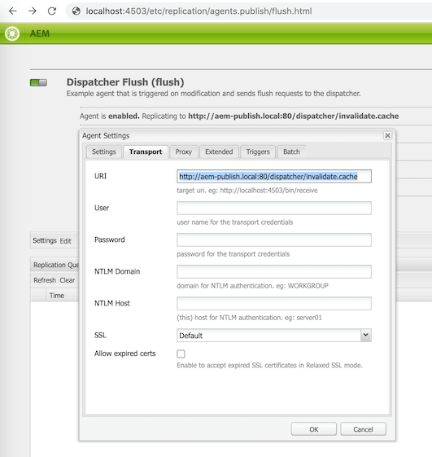

# AMS Dispatcher Docker

A docker container that recreates the Adobe Managed Services "Dispatcher 2.0" file structure on a Red Hat Enterprise Linux 7 OS. 


For your own project, simply add the `Dockerfile` and `envvars` files to your project's `dispatcher/src` folder (and optionally commit to your own version control). 

This repository comes with a baseline dispatcher configuration for a site titled "mysite". These configurations (all `/conf*` directories) can be ignored when copying the aforementioned files into your own project. 

### Setup

1. Modify your `/etc/hosts` file to add the following entries:
```
127.0.0.1 aem-publish.local
127.0.0.1 aem-author.local
```

2. Add the provided `Dockerfile` and `envvars` files to your project's `dispatcher/src` folder

### Build

```
cd <your-aem-project>/dispatcher/src

docker build -t ams-dispatcher .
```

### Run

* Ensure you have an AEM author instance running on [localhost:4502](http://localhost:4502)
* Ensure you have an AEM publish instance running on [localhost:4503](http://localhost:4503)
* Ensure you don't already have a local web server running on port 80. If so, stop it before proceeding.

Run the Docker image:
```
docker run -it -p 80:80 ams-dispatcher
```

You should now be able to hit the above configured hosts: 
* Publish - [http://aem-publish.local/content/we-retail/us/en.html](http://aem-publish.local/content/we-retail/us/en.html) 
* Author - [http://aem-author.local/editor.html/content/we-retail/us/en.html](http://aem-author.local/editor.html/content/we-retail/us/en.html)


### Additional Notes

#### Configure Dispatcher Flush Agent

Enable your [author](http://localhost:4502/etc/replication/agents.author/flush.html) or [publish](http://localhost:4503/etc/replication/agents.publish/flush.html) flush agent with a transport URI of `http://aem-publish.local:80/dispatcher/invalidate.cache` to ensure cached files are invalidated upon activation.



#### Limitations

This Docker image has only been tested on macOS and may not yet work on Windows
